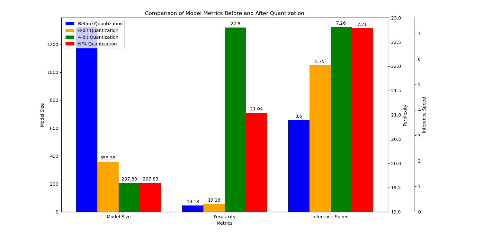

# Quantization and Model Compression

This was done as part of the coursework for CS7.501 Advanced NLP.

## Part 1: Quantization from Scratch

_Code in main.py_

Models tested:

- Salesforce/codegen-350M-mono
- microsoft/phi-1_5
- alpindale/Llama-3.2-1B-Instruct
- EleutherAI/gpt-neo-1.3B
- facebook/opt-1.3b
- facebook/opt-350m

**Summary** :\

- **Model size** :\
 Full model > Parts Quantized model > Fully quantized model
- **Inference speeds** (without explcit bfp16 or similar conversion during computations) :\
 Full model < Parts Quantized model < Fully quantized model (only slightly)
- **Perplexity scores** on wiki dataset :\
 Full model > Parts Quantized model > Fully quantized model

We note that the increase in perplexity scores are not very huge, hence for their decrease in vram requirements, the tradeoff might be worth it.

### Whole model quantization

Output files are present in 'modelname'.txt files.

Lets refer to only the opt-350M model:

- Model size before quantization : 1324.78 MB\
 Model size after quantization : 416.56 MB\
 Memory saved : 908.22 MB

- Overall Average Perplexity before quant: 19.1325\
Overall Average Perplexity after quant: 19.1471

- Inference time for evaluation before quant : 3.61it/s\
 Inference time for evaluation after quant : 3.38it/s

### Partially quantized model

After intensive litrature review (a few perplexity searched + 1/2 papers + chatgpt lmao), we find that a very effective method for partial quantization is quantizing only the first few layers (as they might capture the more borader features of the data, while the subsequent layers capture the finer details etc)

Output files are present in 'N'layersquant'modelname'.txt files where the N layers are the number of layers quantized.

- Model size before quantization : 1324.78 MB\
 Model size after quantization : 1277.65 MB\
 Memory saved : 47.13 MB

- Overall Average Perplexity before quant: 19.1325\
Overall Average Perplexity after partial quant: 19.1338

- Inference time for evaluation before quant : 3.61it/s\
 Inference time for evaluation after quant : 3.57it/s

## Part 2: Bitsandbytes Integration and NF4 Quantization

_Code in 2main.py_

outputs are present in q2_'modelname'.txt files.

Default model size : 1324.785664 MB\
8 bit model size : 359.354368 MB\
4 bit model size : 207.835136 MB\
nf4 model size : 207.835136 MB

Overall Average Perplexity of Default Model: 19.1325 with speed of 3.60it/s

Overall Average Perplexity of 8 bit Model: 19.1612 with speed of 5.75it/s

Overall Average Perplexity of 4 bit Model: 22.8055 with speed of 7.26it/s

Overall Average Perplexity of nf4 bit Model: 21.0444 with speed of 7.21it/s

Hence we see that for memory consumed in Default > 8 bit > 4 bit = nf4 4bit

and inference times also follow the same order. (as all operations are performed as bfp16 for quantized models as well).

We see that perplexity score for Default < 8 bit << 4 bit NF4 < 4 bit.

### NF4 Quantization

**NF4 (Normal Float 4)** is a 4-bit quantization scheme designed to enhance the representation of weights in machine learning models, particularly large language models (LLMs). Unlike traditional linear quantization methods, NF4 normalizes each weight to a range between -1 and 1, leveraging a normal distribution to optimize the quantization process. This normalization allows for a more accurate representation of weight values, making it particularly effective for weights that are normally distributed, which is common in neural network parameters[1][2].

The NF4 format essentially divides the quantization space into bins that correspond to equal areas under a standard normal distribution. This approach contrasts with linear quantization methods, which distribute quantized values uniformly across the range. As a result, NF4 can capture more nuanced variations in weight values, potentially leading to better model performance and efficiency during inference[2][5].

### Differences from Linear Quantization Scales

#### Linear Quantization
- **Uniform Distribution**: Linear quantization maps floating-point values directly to discrete levels in a uniform manner. For instance, in a 4-bit representation, it can represent 16 distinct values ranging from 0 to 15.
- **Simple Mapping**: The quantization process involves straightforward scaling and rounding of floating-point values to fit within the defined integer range.
- **Potential Information Loss**: Linear quantization may lead to significant information loss, especially for weights that do not distribute uniformly.

#### NF4 Quantization
- **Normal Distribution**: NF4 uses a normal distribution for its quantization bins, allowing it to better represent weights that are more densely populated around the mean.
- **Adaptive Mapping**: The mapping of floating-point values to quantized levels is more complex and adaptive, focusing on preserving information where it is most needed.
- **Reduced Information Loss**: By aligning the quantization process with the actual distribution of weights, NF4 minimizes information loss compared to linear methods[1][3].

### Impact on Model Accuracy and Efficiency

#### Model Accuracy
- **Linear Quantization**: While it can significantly reduce model size and memory usage, linear quantization often leads to reduced accuracy due to its simplistic approach. The uniform distribution may not effectively capture the subtleties of weight distributions, resulting in performance degradation when models are deployed in real-world applications[3][5].
  
- **NF4 Quantization**: By utilizing a more sophisticated representation that aligns with the statistical properties of the weights, NF4 can maintain higher accuracy levels even at lower bit widths. Studies have shown that models using NF4 can achieve performance comparable to their full-precision counterparts while benefiting from reduced memory requirements[1][2][5].

#### Model Efficiency
- **Resource Utilization**: Both linear and NF4 quantizations improve resource efficiency by reducing memory footprint and computational load. However, NF4's approach allows for even greater efficiency by optimizing how weights are represented and accessed during computations.
  
- **Inference Speed**: The use of lower precision formats like NF4 can accelerate inference times since less data needs to be processed. This advantage is particularly pronounced in environments with limited computational resources, such as edge devices or mobile platforms[3][5].

In conclusion, while both linear and nonlinear (NF4) quantization techniques aim to reduce model size and improve efficiency, NF4 provides a more nuanced approach that can enhance model accuracy through better alignment with weight distributions. This makes it an attractive option for deploying large models in resource-constrained environments.

## Bonus: GGML Models, GGUF Formats, and llama.cpp

_Code in bonusmain.py_

We see that GGML (General Graph Model Library) and GGUF (General Graph Unified Format) are lightweight model formats designed
for efficient local deployment. GGML models are especially useful for running large language models (LLMs) on devices
with limited resources, making them accessible for edge computing and mobile applications. Llama.cpp is a tool that
enables running GGML models locally, facilitating on-device processing.
